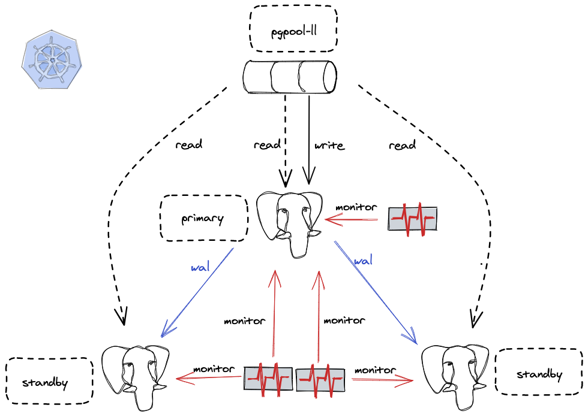

#  RadonDB PostgreSQL
   

## 什么是 RadonDB PostgreSQL

[RadonDB PostgreSQL](https://github.com/radondb/radondb-postgresql-kubernetes) 是基于 `PostgreSQL` 的开源、高可用、云原生集群解决方案。支持一主多从高可用架构，具备自动故障检测和恢复、自由伸缩只读副本等特性

目前 `RadonDB PostgreSQL` 已支持 `Kubernetes` 和 `KubeSphere` 平台部署 `PostgreSQL` 高可用集群。

## 架构图

- 通过 [`repmgr`](https://repmgr.org/docs/current/)实现故障自动转移
- 通过 [`Pgpool-II`](https://www.pgpool.net/)负载读写流量
- 通过`PostgreSQL Streaming Replication`保证数据的强一致

## 核心功能

- PostgreSQL 高可用
    - 主从秒级切换
    - 自由配置异步/同步流复制模式
    - 故障自愈
- 自由伸缩
    - 支持增减集群节点
- 只读流量负载均衡
- 配置高度可自定义
    - 集群、数据库、中间件均支持自定义配置项

## 快速部署

- [ 在 Kubernetes 上部署 RadonDB PostgreSQL 集群](docs/deploy_radondb_postgresql_on_kubernetes.md)

## 协议

RadonDB PostgreSQL 基于 Apache 2.0 协议，详见 [LICENSE](./LICENSE)。

有任何 RadonDB PostgreSQL 错误、问题和功能，请您在 RadonDB PostgreSQL GitHub 提交 Issue。